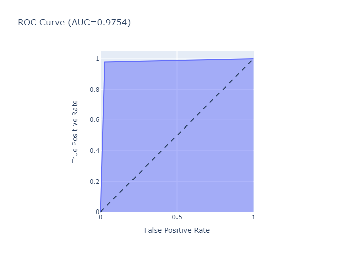
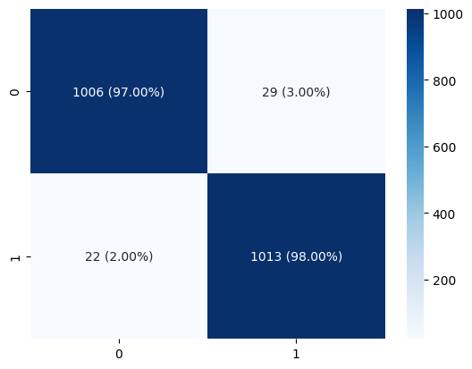
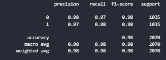

# Data Challange DSW 2023 - Student & Junior Pro
## Problem Statement
A telecommunication company wants to analyze its customer’s behavior. Given the following dataset, build a solution that aims to provide meaningful insights to the telecommunication company. The solution can be in the form of an AI model, dashboard, or analysis report. If participants plan to build an AI model, participants are free to decide features, labels, and metrics when building the model. You are expected to propose an innovative solution from the dataset.

## Methodology
* Data Understanding -> we need to know how much total data in the datasets, total of features, is there any missing value or duplicated data.
* Exploratory Data Analysis (EDA) -> in this stage, we find the correlation between one feature with another. It's very importance stage before go to the next stage.
* Feature Engineering -> from our analysis in EDA, finally we created total 62 features.
* Modelling Approach -> with confident we input our feature into XGBoost algorithm and do evaluate the result with feature importance to get minimum meaningful features.
* Evaluate -> we evaluate our model with some metrics like accuracy, precision, recall, f1-score, ROC AUC score, and confussion matrix.

## Our Solution
From our quick and precise analysis in the limited time, finally we found the solution based on the given datasets.
* We provide AI model created with XGBoost algorithm with final accuracy is 97% all round matrics.
    * ROC Curve :

    
    
    * Confussion Matrix :

    

    * Classification Report :

    

* Our findings from analysis datasets.
    * The client's lifetime before the churn is very important information, usually, the first months in the service are the riskiest, since customers may have their own expectations from the service
    * Making the selling price of the Video Product cheaper, because 19% of customers who churn often use it.
    * Improve service branding, because 25% of customers who do not use any services and  23% with one service used are identified as churn
    * The selling price of the Product services offered more cheaper because 21% of churn customer identified has medium monthly purchases.
    * Last but not least is provides good call center services, 83% churn customer is not use any Call center services

* We also provide tableau dashboard for a quick way to gaining insigth from the data
    * [Tableau Dashboard](https://public.tableau.com/app/profile/ichsan.ali3107/viz/DSWA/Dashboard2)
